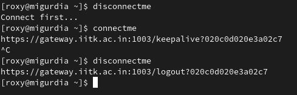
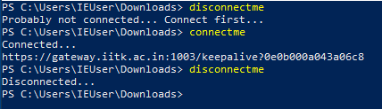

# autoneti
Bash/Powershell script for Fortinet authentication on IITK network. Once connected, autoneti will keep your connection alive so no need to worry about interruption. (My connection sometimes die or sometimes failed to refresh so I created this script. ~~I also wanted a reason to write some shell scripts.~~ :D)

### Installation -
Insert your iitk username and password inside the script and run it.

### Usage
To connect on Linux -
```bash
./autoneti.sh c
```

To disconnect on Linux -
```bash
./autoneti.sh d
```

To connect on Windows -
```powershell
.\autoneti.ps1 c
```

To disconnect on Windows -
```powershell
.\autoneti.ps1 d
```

### Tips
Make alias/function so you can connect/disconnect using one word.

Example in Linux -
```bash
connectme() {
	bash ~/Downloads/autoneti.sh c
}

disconnectme() {
	bash ~/Downloads/autoneti.sh d
}
```

Example in Windows -
```powershell
function connectme {
    powershell.exe "C:\Users\IEUser\Downloads\autoneti.ps1" c
}

function disconnectme {
    powershell.exe "C:\Users\IEUser\Downloads\autoneti.ps1" d
}
```

### Screenshots



